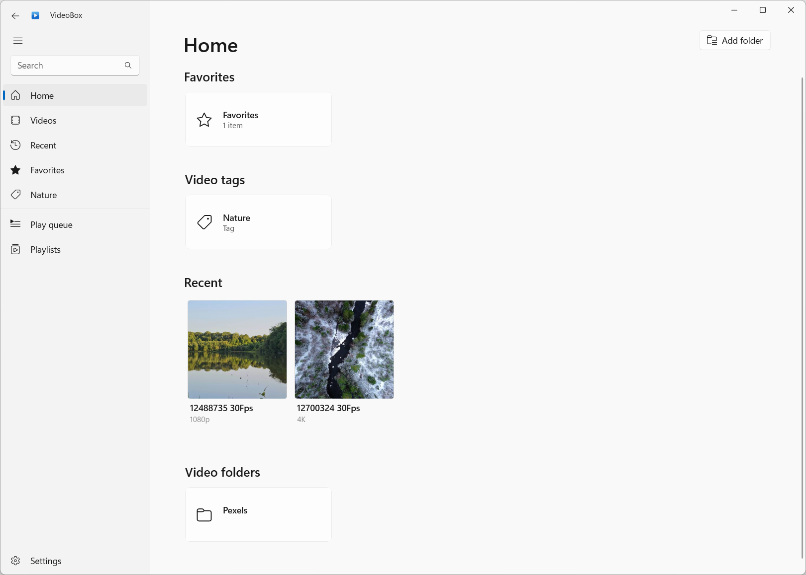
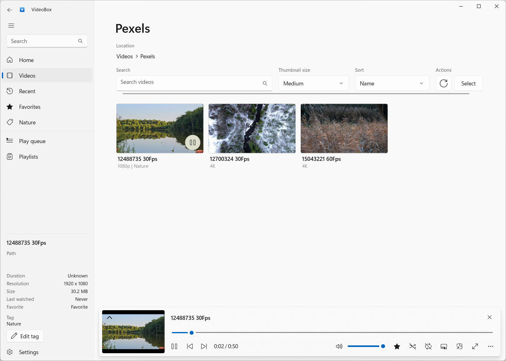
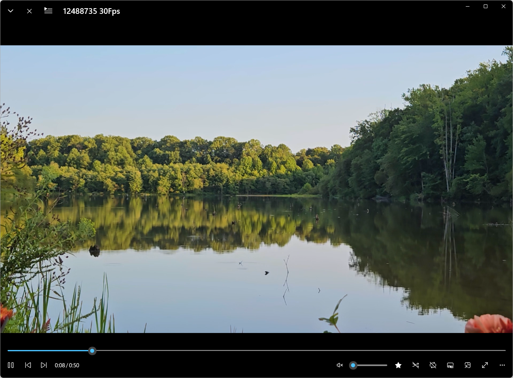
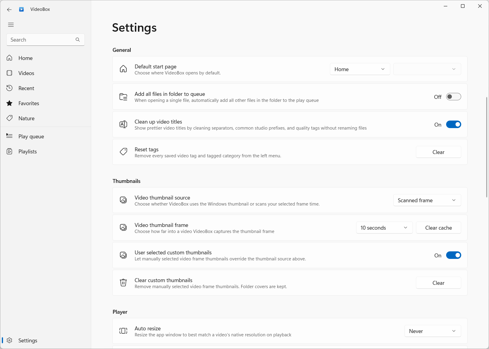

  

<h1 align="center">
  VideoBox
</h1>

  A personal media library player for Windows.

VideoBox is a ClearFeather fork of [Screenbox](https://github.com/huynhsontung/Screenbox), the modern media player by Tung Huynh. It keeps the original open-source foundation and adds personal-library features focused on browsing local video collections.

This fork is not the official Screenbox build. For the original project, releases, and upstream support, visit [huynhsontung/Screenbox](https://github.com/huynhsontung/Screenbox).

VideoBox is built on top of [LibVLCSharp](https://github.com/videolan/libvlcsharp) and the Universal Windows Platform (UWP).

## Screenshots

<table>
  <tr>
    <td></td>
    <td></td>
  </tr>
  <tr>
    <td></td>
    <td></td>
  </tr>
</table>

## Features

- Local video folder browsing with a folder-first library view
- All Videos view with sorting, search, and thumbnail size controls
- Favorites, recent media, playlists, and single-tag organization
- Folder covers from any selected JPEG image
- Optional scanned frame thumbnails and user-selected custom thumbnails
- Automatic title cleanup for common filename patterns
- Metadata side panel for selected videos
- Local-only playback focus with internet capability removed
- VideoBox settings and library metadata are isolated from Microsoft Media Player
- Startup audio preference for remembered volume, mute, or a chosen default level
- Optional app PIN lock

## Install

VideoBox is currently distributed as a sideloaded Windows app package.

1. Download the latest `VideoBox_..._x64.msixbundle` from [Releases](https://github.com/clearfeather/Videobox/releases).
2. Open the downloaded `.msixbundle`.
3. Choose Install or Update.

Windows may show a publisher/certificate warning for sideload builds that are not Microsoft Store signed. If Windows blocks the install, download the matching `.cer` certificate from the same release, install it as a trusted certificate, then open the `.msixbundle` again.

This fork is not currently published to the Microsoft Store or winget.

## Using VideoBox

VideoBox works best when you add the folders you actually browse often.

1. Open **Settings**.
2. Under **Video library locations**, choose **Add folder**.
3. Add your favorite video folders, such as movies, shows, personal clips, or organized collection folders.
4. Go back to **Videos** to browse those folders, or use **All Videos** to see everything together.

Once your folders are added, you can favorite videos, assign a single tag, set folder covers from JPEG images, and choose how thumbnails are generated. Settings also include startup page and audio defaults so the app opens and plays the way you prefer.

VideoBox keeps its own settings, tags, favorites, thumbnail choices, and folder library data. It does not share those app preferences with Microsoft Media Player.

## Build

### Prerequisites

- Visual Studio 2026 or Visual Studio 2022
- UWP / WinUI application development workload
- Windows 11 SDK
- Git

### Quick start

1. Clone this repository.
2. Open `Screenbox.sln` in Visual Studio.
3. Set the solution platform to `x64`.
4. Build the solution.
5. Start debugging with Local Machine.

The internal project and namespace names still use `Screenbox` in many places to keep the fork scoped and avoid unnecessary churn. The visible app name is VideoBox.

## Attribution

VideoBox is derived from Screenbox by Tung Huynh.

- Original project: [huynhsontung/Screenbox](https://github.com/huynhsontung/Screenbox)
- Original author: [Tung Huynh](https://github.com/huynhsontung)

Thank you to Tung Huynh and the Screenbox contributors for the original application.

## Support

VideoBox is a personal open-source fork maintained by ClearFeather. If it is useful to you, a small optional contribution helps support continued development:

- [Make a small donation](https://www.paypal.com/cgi-bin/webscr?cmd=_donations&business=info%40clearfeather.com&item_name=VideoBox&currency_code=USD)
- [Support on GitHub Sponsors](https://github.com/sponsors/clearfeather)

Please also consider supporting the original Screenbox project and its author, [Tung Huynh](https://github.com/huynhsontung).

## License

VideoBox remains open source under the GNU General Public License v3.0, the same license used by Screenbox. See [LICENSE](LICENSE).

Third-party notices are listed in [NOTICE.md](NOTICE.md).
